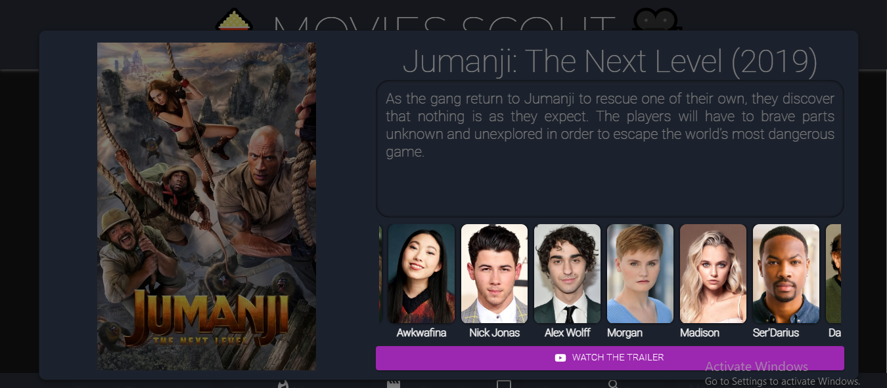
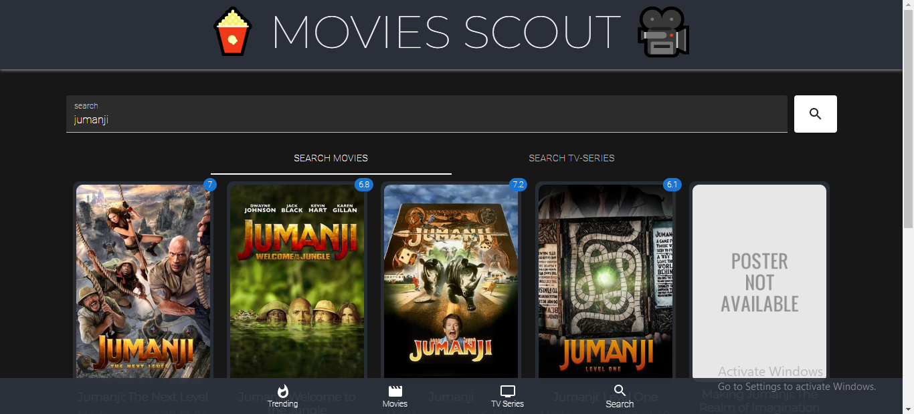

# Movies-Scout

Movies-Scout is a movies/tv-series recommendation web application built using tmdb api.

## Tech Stack

**Client:** React JS
**API**: The Movie Database
  
## [Demo](https://movies-scout.netlify.app)


## Run Locally

Clone the project

```bash
  git clone https://github.com/Lokesh01/react-movie-app
```

Go to the project directory

```bash
  cd react-movie-app
```

Install dependencies

```bash
  npm install
```

Start the server

```bash
  npm run start
```
Start the Client


  
# Features

#### Information Modal


### Search

## Made By

- [@Lokesh01](https://github.com/Lokesh01)
